# [What is OpenTelemetry?](https://opentelemetry.io/docs/)

A short explanation of what OpenTelemetry is and isn’t.

- OpenTelemetry, also known as OTel, is a vendor-neutral open source Observability framework for instrumenting, generating, collecting, and exporting telemetry data such as traces, metrics, and logs.
- Not an observability backend like Jaeger, Prometheus, or other commercial vendors.

## [OtlpExporterOptions](https://github.com/open-telemetry/opentelemetry-dotnet/blob/main/src/OpenTelemetry.Exporter.OpenTelemetryProtocol/README.md#otlpexporteroptions)

> [!NOTE]
> When using `OtlpExportProtocol.HttpProtobuf`, the full URL MUST be provided, including the signal-specific path v1/{signal}. For example, for traces, the full URL will look like `http://your-custom-endpoint/v1/traces`.
