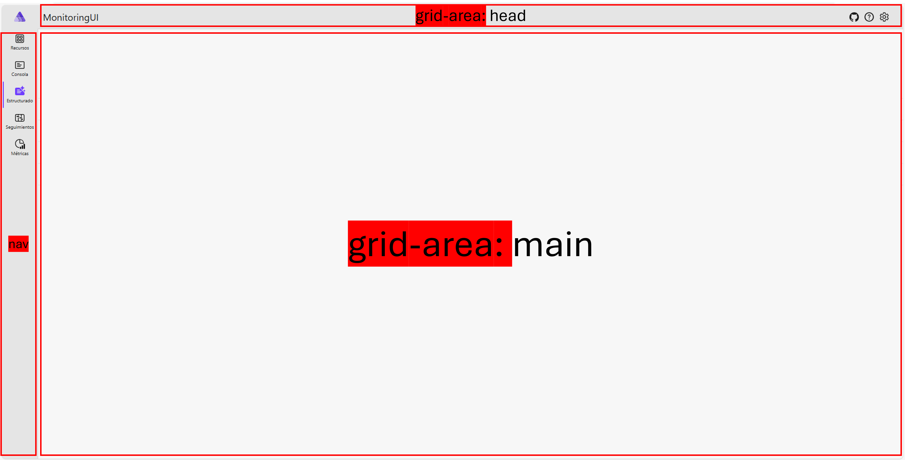

```css
::deep.layout {
    height: 100vh;
    width: 100vw;
    display: grid;
    grid-template-columns: auto 1fr;
    grid-template-rows: auto auto 1fr;
    grid-template-areas:
    "icon head"
    "nav messagebar"
    "nav main";
    background-color: var(--fill-color);
    color: var(--neutral-foreground-rest);
}
```

---

```
┌───────┬───────────────────────────────┐
│ icon  │             head              │
├───────┼───────────────────────────────┤
│ nav   │             main              │
│       │                               │
│       │                               │
│       │                               │
└───────┴───────────────────────────────┘
```



<table>
    <thead>
        <tr>
            <th>Desktop</th>
            <th>Mobile</th>
        </tr>
    </thead>
    <tbody>
        <tr>
            <td>
                <pre>
                    <code class="language-css">
@media (max-width: 768px) {
    ::deep.layout {
        height: 100vh;
        width: 100vw;
        display: grid;
        grid-template-columns: auto 1fr;
        grid-template-rows: auto auto 1fr;
        grid-template-areas:
            "icon head"
            "nav messagebar"
            "nav main";
        background-color: var(--fill-color);
        color: var(--neutral-foreground-rest);
    }

        ::deep.layout > .brand-icon {
            grid-area: icon;
            display: flex;
            align-items: center;
            justify-content: center;
            background-color: var(--neutral-layer-4);
        }

        ::deep.layout > header {
            grid-area: head;
        }

        ::deep.layout > .fluent-appbar {
            grid-area: nav;
            overflow-y: auto;
            background: var(--neutral-layer-4);
        }

        ::deep.layout > .body-content {
            grid-area: main;
            overflow-x: auto; /* allow horizontal scrolling */
            overflow: auto;
            border-left: 1px solid var(--neutral-stroke-rest);
        }

        ::deep.layout > .messagebar-container {
            grid-area: messagebar;
            border-top: 1px solid var(--neutral-stroke-rest);
            border-left: 1px solid var(--neutral-stroke-rest);
        }

    ::deep .header-right {
        margin-left: auto;
    }

    ::deep.layout > header {
        background-color: var(--neutral-layer-4);
        margin-bottom: 0;
    }

        ::deep.layout > header > .header-gutters > fluent-anchor {
            font-size: var(--type-ramp-plus-2-font-size);
        }

    ::deep .brand-icon fluent-anchor.logo::part(control) {
        padding: 0;
        border: none;
    }

    ::deep .brand-icon fluent-anchor.logo,
    ::deep .brand-icon fluent-anchor.logo::part(control),
    ::deep .brand-icon fluent-anchor.logo::part(content) {
        height: 24px;
        width: 24px;
    }

    ::deep.layout > header > .header-gutters {
        margin-left: 0;
    }
}
                    </code>
                </pre>
            </td>
            <td>
                <pre>
                    <code class="language-css">
@media (min-width: 768px) {
    ::deep.layout {
        height: 100vh;
        width: 100vw;
        display: grid;
        grid-template-columns: auto 1fr;
        grid-template-rows: auto auto auto 1fr;
        grid-template-areas:
            "icon head"
            "nav-menu nav-menu"
            "messagebar messagebar"
            "main main";
        background-color: var(--fill-color);
        color: var(--neutral-foreground-rest);
    }

        ::deep.layout > .brand-icon {
            grid-area: icon;
            display: flex;
            align-items: center;
            justify-content: center;
            background-color: var(--neutral-layer-4);
        }

        ::deep.layout > header {
            grid-area: head;
        }

        ::deep.layout > .fluent-appbar {
            grid-area: nav;
            overflow-y: auto;
            background: var(--neutral-layer-4);
        }

        ::deep.layout > .body-content {
            grid-area: main;
            overflow-x: auto; /* allow horizontal scrolling */
            overflow: auto;
            border-left: 1px solid var(--neutral-stroke-rest);
        }

        ::deep.layout > .messagebar-container {
            grid-area: messagebar;
            border-top: 1px solid var(--neutral-stroke-rest);
            border-left: 1px solid var(--neutral-stroke-rest);
        }

    ::deep .header-right {
        margin-left: auto;
    }

    ::deep.layout > header {
        background-color: var(--neutral-layer-4);
        margin-bottom: 0;
    }

        ::deep.layout > header > .header-gutters > fluent-anchor {
            font-size: var(--type-ramp-plus-2-font-size);
        }

    ::deep .brand-icon fluent-anchor.logo::part(control) {
        padding: 0;
        border: none;
    }

    ::deep .brand-icon fluent-anchor.logo,
    ::deep .brand-icon fluent-anchor.logo::part(control),
    ::deep .brand-icon fluent-anchor.logo::part(content) {
        height: 24px;
        width: 24px;
    }

    ::deep.layout > header > .header-gutters {
        margin-left: 0;
    }
}
                    </code>
                </pre>
            </td>
        </tr>
    </tbody>
</table>

`Mobile`
```css
    ::deep.layout > .brand-icon {
        padding-left: 15px;
        background-color: var(--neutral-layer-4);
    }

        ::deep.layout > .brand-icon fluent-anchor {
            margin-left: 5px;
        }

        ::deep.layout > .brand-icon .navigation-button {
            border: 1px solid #a8aeb3;
        }
```

---

`Common`

```css
    ::deep.layout > header > .header-gutters > fluent-button[appearance=stealth]:not(:hover)::part(control),
    ::deep.layout > header > .header-gutters > fluent-anchor[appearance=stealth]:not(:hover)::part(control),
    ::deep.layout > header > .header-gutters > fluent-anchor[appearance=stealth].logo::part(control),
    ::deep.layout > .brand-icon fluent-anchor[appearance=stealth].logo::part(control) {
        background-color: var(--neutral-layer-4);
    }
```

---

`MainLayout.razor`

```
┌───────┬───────────────────────────────┐
│ icon  │             head              │
├───────┼───────────────────────────────┤
│ nav   │             main              │
│       │                               │
│       │                               │
│       │                               │
└───────┴───────────────────────────────┘
```

```razor
@inherits LayoutComponentBase
@using Aspire.Dashboard.Components.ResourceIcons

<div class="layout">
        @* grid-area: icon; *@
	<div class="brand-icon">
		<FluentAnchor Href="/"
                              Class="logo"
                              Appearance="Appearance.Stealth"
                              title="@Loc[nameof(Resources.Layout.MainLayoutAspire)]"
                              aria-label="@Loc[nameof(Resources.Layout.MainLayoutAspire)]">

			<FluentIcon Value="@(new AspireIcons.Size24.Logo())" />

		</FluentAnchor>
	</div>

	@if (ViewportInformation.IsDesktop)
	{
              @* grid-area: head; *@
		<FluentHeader>

			<FluentAnchor Href="/" Class="logo" Appearance="Appearance.Stealth">
				Aspire
			</FluentAnchor>

			<div style="flex-grow: 1"></div>

			<FluentAnchor Href="https://aka.ms/dotnet/aspire/repo"
                                      Target="_blank"
                                      Rel="noreferrer noopener"
                                      Appearance="Appearance.Stealth">
				<FluentIcon Value="@(new AspireIcons.Size24.GitHub())" />
			</FluentAnchor>

		</FluentHeader>

                @* grid-area: nav; *@
		<DesktopNavMenu />
	}
	else
	{
		<FluentMessageBar Title="Descriptive title" Intent="@MessageIntent.Success">
			ViewportInformation.IsDesktop: False
		</FluentMessageBar>
	}

	@* grid-area: messagebar; *@
	<div class="messagebar-container">
		<FluentMessageBarProvider Section="@MessageBarSection" Class="top-messagebar" />
	</div>

	@* grid-area: main; *@
	<FluentBodyContent Class="custom-body-content body-content">
		<FluentToastProvider MaxToastCount="3" Timeout="5000" />
		@Body
	</FluentBodyContent>
</div>
```
