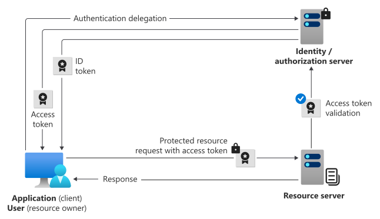

# [Make secure .NET Microservices and Web Applications](https://learn.microsoft.com/en-us/dotnet/architecture/microservices/secure-net-microservices-web-applications/)

Hay tantos aspectos sobre la seguridad en microservicios y aplicaciones web que el tema fácilmente podría ocupar varios libros como este.


## Implementación de la autenticación en microservicios y aplicaciones web de .NET

Cuando los servicios pueden ser acedidos directamente, se puede usar un microservicio de autenticación dedicado que actúe como un servicio de token de seguridad (STS) para autenticar a los usuarios.

* ASP.NET Core Identity
  - Para autenticar a los usuarios
  - No hay que instalar el paquete, ya viene incluido
  - En un project `classlib` para el Application.Domain, se debera instalar `Microsoft.Extension.Identity.Stores`
  - Para utilizar con `EntityFrameworkCore` se debe instalar `Microsoft.AspNetCore.Identity.EntityFrameworkCore`

* Servidor OpenID Connect personalizado que utiliza OpenIddict
  - Para administrar el acceso a los recursos del usuario de las aplicaciones registradas.
    - `OpenIddict.AspNetCore`
    - `OpenIddict.EntityFrameworkCore`

## Authorization server
También denominado *identity provider* o *IdP*, gestiona de forma segura la información del usuario final, su acceso y las relaciones de confianza entre las partes en el flujo de autenticación. El servidor de autorización emite los tokens de seguridad que utilizan las aplicaciones y las API para otorgar, denegar o revocar el acceso a los recursos (autorización) después de que el usuario haya iniciado sesión (autenticado).

### Authorization server: Creación de la capa de Dominio

1. Definir la entidad que va identificar a los usuarios en el servidor. Debe extender de `IdentityUser`.
   
   ```csharp
    public class ApplicationUser : IdentityUser
    {
        [Required]
        public string CardNumber { get; set; }
        [Required]
        public string SecurityNumber { get; set; }
        [Required]
        [RegularExpression(@"(0[1-9]|1[0-2])\/[0-9]{2}", ErrorMessage = "Expiration should match a valid MM/YY value")]
        public string Expiration { get; set; }
        [Required]
        public string CardHolderName { get; set; }
        public int CardType { get; set; }
        [Required]
        public string Street { get; set; }
        [Required]
        public string City { get; set; }
        [Required]
        public string State { get; set; }
        [Required]
        public string Country { get; set; }
        [Required]
        public string ZipCode { get; set; }
        [Required]
        public string Name { get; set; }
        [Required]
        public string LastName { get; set; }
    }
   ```
     
### Authorization server: Creacion de la capa infrastructura
1. Creación del `DbContext` para administrar la persistencia de los datos
   - Instalar el paquete
     ```powershell
     dotnet add package Microsoft.AspNetCore.Identity.EntityFrameworkCore --version 8.0.8
     dotnet add package OpenIddict.EntityFrameworkCore --version 5.8.0
     ```
   
   - Extender de `IdentityDbContext` pasandole la entidad `ApplicationUser`
     
     ```csharp
     public class OpenIDContext : IdentityDbContext<ApplicationUser> { }
     ```
      
   - Registrar las entidades OpenIddict en el modelo
     
     ```csharp
     protected override void OnModelCreating(DbModelBuilder modelBuilder)
     {
         base.OnModelCreating(modelBuilder);
         
         modelBuilder.UseOpenIddict();
     }
     ```
     
2. Definir el provedor de persistencia de datos.
   - Instalar el paquete
     
     ```powershell
     dotnet add package MySql.EntityFrameworkCore --version 8.0.8
     ```

   - Generar la migraciones (Opcional)
     
     - [Design-time services](https://learn.microsoft.com/en-us/ef/core/cli/services)
    
     - [Design-time DbContext Creation](https://learn.microsoft.com/en-us/ef/core/cli/dbcontext-creation?tabs=dotnet-core-cli)
    
     - Instalar el paquete
       
       ```powershell
       dotnet add package Microsoft.EntityFrameworkCore.Design --version 8.0.8
       ```
         
     - Ejecutar el commando
       
       ```powershell
        dotnet ef migrations add InitialCreate --context "OpenIDContext" --startup-project "EShopOnContainers.Identity.csproj" --output-dir "Infrastructure/Migrations"
       ```
         
   - Establecer un conjunto incial de datos
     
     - Usuarios (IdentityUser)
       
     - Applicaciones (OpenIddictApplicationDescriptor)


### Authorization server: Creación de la capa de Application
1. Crea el controlador de autorización
     
   - Instalar el paquete
     ```powershell
     dotnet add package OpenIddict.AspNetCore --version 5.8.0
     ```
         
   - Crea el `/authorize` endpoint para obtener el `authorization_code`, cuando la aplicación cliente, previamente registrada, lo solicita durante la autenticación del usuario.
     - También puedes recibir un `id_token` si lo solicitas y tienes `Permissions.GrantTypes.Implicit` habilitada en el registro de tu aplicación.
     - Este comportamiento a veces se denomina `hybrid flow`.
       
     ```csharp
        [HttpGet(template: "~/connect/authorize")]
        [HttpPost(template: "~/connect/authorize")]
        [IgnoreAntiforgeryToken]
        public async Task<IActionResult> Authorize()
        {
            /** 
             * The GetOpenIddictServerRequest() method is part of the OpenIddict library and
             * is used to access the OIDC protocol details that were sent to the server.
             * * Details included in the request
             *   client_id=00001111-aaaa-2222-bbbb-3333cccc4444
             *   &response_type=code id_token
             *   &redirect_uri=http://localhost
             *   &response_mode=fragment
             *   &scope=openid offline_access
             */
            var request = HttpContext.GetOpenIddictServerRequest() ??
                throw new InvalidOperationException(message: "The OpenID Connect request cannot be retrived.");
        
            /**
             * The AuthenticateAsync method checks the current HTTP request to determine 
             * if the user is authenticated. It evaluates the authentication information 
             * (e.g., cookies, tokens) provided in the request using a specific authentication scheme.
             */
            var authResult = await HttpContext.AuthenticateAsync(scheme: IdentityConstants.ApplicationScheme);
        
            if (!authResult.Succeeded)
            {
                /**
                 * The endpoint to which the challenge redirects depends 
                 * on the specific configuration of the authentication scheme,
                 * particularly in the IdentityConstants.ApplicationScheme case, 
                 * which is typically associated with ASP.NET Core Identity's application cookie.
                 * * The default login endpoint is /Account/Login
                 */
                return Challenge(
                    authenticationSchemes: IdentityConstants.ApplicationScheme,
                    properties: new AuthenticationProperties
                    {
                        RedirectUri = Request.PathBase + Request.Path + QueryString.Create(
                            parameters: Request.HasFormContentType
                                ? Request.Form.ToList()
                                : Request.Query.ToList())
                    });
            }
        
            /**
             * Create a new ClaimsIdentity containing the claims that
             * will be used to create an id_token, a token or a code.
             */
            var identity = new ClaimsIdentity(
                authenticationType: TokenValidationParameters.DefaultAuthenticationType,
                nameType: Claims.Name,
                roleType: Claims.Role);
            
            /**
             * Apps that operate without interaction with a user: 
             * * Use the client_id as the subject identifier.
             * Apps taht perform functions on behalf of a user:
             * * Use the user’s identity as the subject identifier.
             */
            identity.SetClaim(type: Claims.Subject, value: authResult.Principal.Identity.Name);
            identity.SetClaim(type: Claims.Name,    value: authResult.Principal.Identity.Name);
        
            identity.SetDestinations(static claim => claim.Type switch
            {
                // Allow the "name" claim to be stored in both the access and identity tokens
                // when the "profile" scope was granted (by calling principal.SetScopes(...)).
                Claims.Name when claim.Subject.HasScope(Scopes.Profile)
                    => [Destinations.AccessToken, Destinations.IdentityToken],
        
                // Otherwise, only store the claim in the access tokens.
                _ => [Destinations.AccessToken]
            });
        
            return SignIn(new ClaimsPrincipal(identity), OpenIddictServerAspNetCoreDefaults.AuthenticationScheme);
        }
     ```
   
   - Crea el `/token` endpoint para obtener el `access_token`
     ```csharp
      [HttpPost(template: "~/connect/token")]
      public async Task<IActionResult> Exchange()
      {
          /** 
           * The GetOpenIddictServerRequest() method is part of the OpenIddict library and
           * is used to access the OIDC protocol details that were sent to the server.
           * * Details included in the request
           *   client_id = 
           *   &client_secret = 
           *   &scope = 
           *   &code = ...
           *   &redirect_uri = 
           *   &grant_type =
           *   &code_verifier =  
           */
          var request = HttpContext.GetOpenIddictServerRequest() ??
              throw new InvalidOperationException(message: "The OpenID Connect request cannot be retrived.");
  
          ClaimsPrincipal claimsPrincipal;
  
          // &grant_type = client_credentials // OAuth 2.0 client credentials flow
          if (request.IsClientCredentialsGrantType())
          {
              // Note: the client credentials are automatically validated by OpenIddict:
              // if client_id or client_secret are invalid, this action won't be invoked.
  
              /**
               * Create a new ClaimsIdentity containing the claims that
               * will be used to create an id_token, a token or a code.
               */
              var identity = new ClaimsIdentity(
                  authenticationType: TokenValidationParameters.DefaultAuthenticationType,
                  nameType: Claims.Name,
                  roleType: Claims.Role);
  
              // Subject (sub) is a required field, Use the client_id as the subject identifier.
              identity.SetClaim(Claims.Subject, request.ClientId ?? throw new InvalidOperationException());
  
              claimsPrincipal = new ClaimsPrincipal(identity);
  
              claimsPrincipal.SetScopes(request.GetScopes());
          }
          // &grant_type = authorization_code // OAuth 2.0 authorization code flow
          else if (request.IsAuthorizationCodeGrantType())
          {
              // Retrive the claims principal stored in the authorization code
              claimsPrincipal = (await HttpContext.AuthenticateAsync(
                  scheme: OpenIddictServerAspNetCoreDefaults.AuthenticationScheme))
                  .Principal!;
          }
          // &grant_type=refresh_token // Any flow
          else if (request.IsRefreshTokenGrantType())
          {
              // Retrive the claims principal stored in the refresh token
              claimsPrincipal = (await HttpContext.AuthenticateAsync(
                  scheme: OpenIddictServerAspNetCoreDefaults.AuthenticationScheme))
                  .Principal!;
          }
          else
          {
              throw new InvalidOperationException(message: "The specified grand type is not support.");
          }
  
          // Returning a SignInResult will ask OpenIddict to issue the appropriate access/identity token.
          return SignIn(principal: claimsPrincipal, authenticationScheme: OpenIddictServerAspNetCoreDefaults.AuthenticationScheme);
      }
     ```
    
   - Crea el `/userinfo` endpoint para obtener datos adicionales del usuario.
    
       - No se recomienda. Considere utilizar un `id_token` para obtener la información del usuario.
   
2. Crea el controlador de Authenticacion (AccountController)
   - Crear los modelos necesarios
     - `AccountLoginViewModel.cs`
     - `AccountRegisterViewModel.cs`
   
   - Crea el `/Login` endpoint para autenticar al usuario.
     - Cuando una applicación necesita obtener un `ID token` en nombre de un usuario, si el usuario no ha iniciado sesión (no ha autorizado a la aplicación), sera redirigido al `/Login` endpoint para obtener el `authorization_code`.
     - Cuando un usuario intenta acceder a una página restringida a la que no está autorizado a acceder o cuando no ha sido autenticado por el sistema.
         
   - Crea el `/Logout` endpoint para borra las credenciales del usuario almacenadas.
     
   - Crea el `/Register` endpoint para los nuevos usuarios.
     
3. Configurar la UI
   - Agregar los archivos staticos
   - Importar los modelos que se van a tilizar en las vistas
   - Crear las vistas
   - Crear el `_Layout`
       
4. Configurar los servicios y el flujo de procesamiento de solicitudes utilizando una clase `Startup`.
   - Agrega los servicios
   - Agregar los controladores
     
     ```csharp
     services.AddMvc(setupAction: options => options.EnableEndpointRouting = false);
     ```
         
   - Agrega el DbContext
         
     ```csharp
         services.AddDbContext<OpenIDContext>(optionsAction: options =>
         {
            options.UseMySQL(
                connectionString: Configuration["ConnectionString"] ??
                    throw new InvalidOperationException(message: $"Connection string not found."),
                mySqlOptionsAction: actions =>
                {
                    // Configuring Connection Resiliency
                    actions.EnableRetryOnFailure(maxRetryCount: 10, maxRetryDelay: TimeSpan.FromSeconds(30), errorNumbersToAdd: null);
                });
         });
     ```
         
   - Agrega Identity
         
     ```csharp
     services.AddIdentity<ApplicationUser, IdentityRole>()
         .AddEntityFrameworkStores<OpenIDContext>();
     ```
         
   - Agrega el proveedor OpenID Connect
     
     [OpenIddict](https://documentation.openiddict.com/guides/getting-started/creating-your-own-server-instance)
         
     ```csharp
         services.AddOpenIddict()
         
            // Register the OpenIddict core components.
            .AddCore(options =>
            {
                // Configure OpenIddict to use the Entity Framework Core stores and models.
                // Note: call ReplaceDefaultEntities() to replace the default entities.
                options.UseEntityFrameworkCore()
                       .UseDbContext<OpenIDContext>();
            });
         
         services.AddOpenIddict()
         
            // Register the OpenIddict server components.
            .AddServer(options =>
            {
                // Enable the token endpoint.
                options.SetAuthorizationEndpointUris(uris: "connect/authorize")
                    .SetTokenEndpointUris(uris: "connect/token");
         
                // Enable the client credentials flow.
                options.AllowClientCredentialsFlow()
                    // ERROR: The specified 'response_type' is not supported.
                    .AllowAuthorizationCodeFlow()
                    .RequireProofKeyForCodeExchange()
                    .AllowRefreshTokenFlow();

                // Register scopes (permissions)
                options.RegisterScopes(scopes: new[]
                {
                    OpenIddictConstants.Scopes.OpenId,
                    OpenIddictConstants.Scopes.Profile,
                    OpenIddictConstants.Scopes.OfflineAccess
                });
         
                // Register the signing and encryption credentials.
                options.AddDevelopmentEncryptionCertificate()
                       .AddDevelopmentSigningCertificate();
         
                // Register the ASP.NET Core host and configure the ASP.NET Core options.
                options.UseAspNetCore()
                    .EnableTokenEndpointPassthrough()
                    // ERROR: Openiddict with dotnet core 5 giving the errors as "this server only accepts HTTPS requests."
                    // InvalidOperationException: IDX20803: Unable to obtain configuration from: /.well-known/openid-configuration.
                    .DisableTransportSecurityRequirement();
            });
     ```
           
     > **NOTA**
     > <br/>De forma predeterminada, el servidor OpenIddict rechaza las solicitudes que no sean HTTPS por razones de seguridad y devolverá una página de error al autor de la llamada.
     > ```csharp
     > // Register the ASP.NET Core host and configure the ASP.NET Core options.
     > options.UseAspNetCore()
     >     .EnableTokenEndpointPassthrough()
     >     // ERROR: Openiddict with dotnet core 5 giving the errors as "this server only accepts HTTPS requests."
     >     // InvalidOperationException: IDX20803: Unable to obtain configuration from: /.well-known/openid-configuration.
     >     .DisableTransportSecurityRequirement();
     > ```
           
     > **NOTA**
     > <br/>Asegúrese de que el middleware de autenticación de ASP.NET Core esté registrado correctamente
     > ```csharp
     > /// No web page found for web address: 
     > /// * https://localhost:45105/.well-known/openid-configuration
     > app.UseAuthentication();
     > ```
           
     > **NOTA**
     > <br/>El OpenID Connect handler solicita automáticamente los tokens apropiados utilizando el `code` devuelto desde el punto final de autorización. Es decir, OpenID Connect esta utilizando `authorization code flow` con `Proof Key for Code Exchange (PKCE)`. Asegurate que el servidor permita:
     > ```csharp
     > // Enable the client credentials flow.
     > options.AllowClientCredentialsFlow()
     >     // ERROR: he specified 'response_type' is not supported.
     >     .AllowAuthorizationCodeFlow()
     >     .RequireProofKeyForCodeExchange()
     >     .AllowRefreshTokenFlow();
     > ```

5. [Aplicar migraciones en tiempo de ejecución](https://learn.microsoft.com/en-us/ef/core/managing-schemas/migrations/applying?tabs=dotnet-core-cli#apply-migrations-at-runtime)
   Para aplicar migraciones de forma programática, llame a `context.Database.Migrate()`. Por ejemplo, una aplicación ASP.NET típica puede hacer lo siguiente:
 
   ```csharp
   public static void Main(string[] args)
   {
       var host = CreateHostBuilder(args).Build();

       using (var scope = host.Services.CreateScope())
       {
           var db = scope.ServiceProvider.GetRequiredService<ApplicationDbContext>();
           db.Database.Migrate();
       }

       host.Run();
   }
   ```

## Client
El cliente en un OAuth exchange es la aplicación que solicita acceso a un recurso protegido. El cliente podría ser una aplicación web que se ejecuta en un servidor, una single-page web app que se ejecuta en el navegador web de un usuario o una API web que llama a otra API web.

### [Configure OpenID Connect Web authentication](https://learn.microsoft.com/en-us/aspnet/core/security/authentication/configure-oidc-web-authentication?view=aspnetcore-9.0#setup-the-openid-connect-client)
1. Instalar el paquete
   ```powershell
   dotnet add package Microsoft.AspNetCore.Authentication.OpenIdConnect --version 8.0.8
   ```
     
2. Configure el OpenID Connect authentication en el cliente
   ```csharp
    services.AddAuthentication(configureOptions: options =>
    {
        options.DefaultScheme = CookieAuthenticationDefaults.AuthenticationScheme;
        options.DefaultChallengeScheme = OpenIdConnectDefaults.AuthenticationScheme;
    })
        .AddCookie()
        .AddOpenIdConnect(configureOptions: options =>
        {
            /// Responsible of persisting user's identity after a successful authentication.
            options.SignInScheme = CookieAuthenticationDefaults.AuthenticationScheme;

            /// Setup the OpenID Connect client
            options.ClientId = "webmvc";
            options.ClientSecret = "secret";

            /// Both the sign-in and sign-out paths MUST be registered as redirect URIs.
            /// * The default values are /signin-oidc and /signout-callback-oidc.
            /// * When using the ASP.NET Core OpenID Connect middleware,
            /// * the /signin-oidc endpoint is automatically handled for you.
            /// * You don’t need to write custom logic unless you want to extend or customize the behavior.
            // options.CallbackPath = "/signin-oidc";
            // options.SignedOutCallbackPath = "/signout-callback-oidc";
            // options.RemoteSignOutPath = "/signout-oidc";
            
            options.ResponseType = OpenIdConnectResponseType.Code;

            /// Make sure the ASP.NET Core authentication middleware is correctly registered
            /// * InvalidOperationException: IDX20803: Unable to obtain configuration from: /.well-known/openid-configuration'.
            options.Authority = Configuration["IdentityUrl"];

            /// This property is set to false to reduce the size of the final authentication cookie
            options.SaveTokens = true;
            
            /// InvalidOperationException: The MetadataAddress or Authority must use HTTPS
            /// unless disabled for development by setting RequireHttpsMetadata=false.
            options.RequireHttpsMetadata = false;
            
            /// Mapping claims using OpenID Connect authentication
            /// The profile claims can be returned in the id_token, which is returned after a successful authentication.
            /// * The ASP.NET Core client app only requires the profile scope.
            /// * When using the id_token for claims, no extra claims mapping is required.
            /// * MapInboundClaims MUST be set to false for most OIDC providers, which prevents renaming claims.
            options.MapInboundClaims = false;
            options.TokenValidationParameters.NameClaimType = "name";
            options.TokenValidationParameters.RoleClaimType = "roles";
            
            /// Another way to get the user claims is to use the OpenID Connect User Info API. 
            // options.GetClaimsFromUserInfoEndpoint = true;

            options.Scope.Clear();
            options.Scope.Add("openid");
            options.Scope.Add("profile");
            // options.Scope.Add("orders");
            // options.Scope.Add("basket");
            // options.Scope.Add("marketing");
            // options.Scope.Add("locations");
            // options.Scope.Add("webshoppingagg");
            // options.Scope.Add("orders.signalrhub");
        });
   ```
   > **NOTA**
   > <br/>El OpenID Connect handler utiliza `authorization code flow` con `Proof Key for Code Exchange (PKCE)`.

     
3. Crea un controlador para administrar la authenticacion (AccountController)
   - Agrega el `[Authorize]` para forzar la autenticación

     ```csharp
     [Authorize]
     public class AccountController : Controller
     {
         // ....
     }
     ```
     
   - [Implementa una pagina de incio de sesión](https://learn.microsoft.com/en-us/aspnet/core/security/authentication/configure-oidc-web-authentication?view=aspnetcore-9.0#implement-login-page)
     
     ```csharp
     public async Task<IActionResult> Login(string returnUrl)
     {
        var token = await HttpContext.GetTokenAsync(tokenName: "access_token");

        if (token != null)
        {
            ViewData["access_token"] = token;
        }

        return RedirectToAction(actionName: "Index", controllerName: "Catalog");
     }
     ```
     
   - [Implemente una página de cierre de sesión](https://learn.microsoft.com/en-us/aspnet/core/security/authentication/configure-oidc-web-authentication?view=aspnetcore-9.0#add-a-new-logoutcshtml-and-signedoutcshtml-razor-pages-to-the-project)
     
     ```csharp
     public IActionResult Logout()
     {
        return SignOut(
            authenticationSchemes: new []
            {
                // Clear auth cookie
                CookieAuthenticationDefaults.AuthenticationScheme,
                // Redirect to OIDC provider signout endpoint
                OpenIdConnectDefaults.AuthenticationScheme
            },
            properties: new AuthenticationProperties
            {
                RedirectUri = "/Account/Logout"
            });
     }
     ```


# Autenticación
La autenticación es el proceso de determinar la identidad de un usuario. El mecanismo principal de ASP.NET Core para identificar a los usuarios de una aplicación es [ASP.NET Core Identity](https://docs.microsoft.com/aspnet/core/security/authentication/identity).

ASP .NET Core Identity se configura normalmente mediante una base de datos de SQL Server para almacenar nombres de usuario, contraseñas y datos de perfil. Como alternativa, se pueden utilizar otros almacenamientos de persistencia.

La autenticación con ASP.NET Core Identity funciona bien para muchos escenarios de aplicaciones web en los que es adecuado almacenar información de usuario (incluida la información de inicio de sesión, los roles y las notificaciones) en una cookie. Sin embargo, en escenarios como una API web de ASP.NET que expone puntos de conexión RESTful accesibles por aplicaciones SPA (Single-Page Application) o incluso otras APIs web, el uso de cookies no es adecuado. En estos casos, para habilitar una autenticación segura y escalable, ASP.NET Core ofrece soporte para [OAuth 2.0 y OpenID Connect](https://learn.microsoft.com/en-us/entra/identity-platform/v2-protocols), que permiten la autenticación y autorización sin necesidad de gestionar cookies, facilitando la integración con aplicaciones distribuidas y servicios externos.

OpenID Connect (OIDC) amplía el `protocolo de autorización` OAuth 2.0 para su uso como otro protocolo de autenticación. Puede utilizar OIDC para habilitar el inicio de sesión único (SSO) entre sus aplicaciones habilitadas para OAuth mediante un token de seguridad denominado *ID token*.

> [!NOTE]
> Tanto el cliente de la aplicación como el usuario de la aplicación se autentican en el flujo confidencial. El cliente de la aplicación utiliza un secreto de cliente o una aserción de cliente para autenticarse.

Mientras que `ASP.NET Core Identity` maneja la administración de usuarios (como registro, inicio de sesión y roles dentro de una sola aplicación), `OAuth 2.0 y OpenID Connect` permiten al cliente autenticarse una vez y usar los tokens para acceder a los recursos, lo que garantiza que el flujo de autenticación y autorización se pueda compartir entre diferentes aplicaciones o servicios en un sistema Single Sign-On (SSO).

Si prefiere emitir tokens de forma local en lugar de usar un proveedor de identidades externo, puede aprovechar algunas bibliotecas de terceros que son buenas. `IdentityServer4` y `OpenIddict` son proveedores de OpenID Connect que se integran fácilmente con `ASP.NET Core Identity` para permitirle emitir tokens de seguridad desde un servicio ASP.NET Core.

Así es como funciona en el contexto de ASP.NET Core y SSO:

1. **Autenticación en el cliente:** el usuario inicia sesión a través de un proveedor de identidad (por ejemplo, via OpenID Connect u OAuth 2.0) en la aplicación cliente. Una vez autenticado, el cliente recibe un token (como un **ID token** o un **access token**).

2. **Autorización para acceder a los recursos:** el token de acceso, que a menudo se transmite junto con cada solicitud, demuestra que el cliente está autorizado para acceder a recursos protegidos (por ejemplo, API). Este token lo emite el proveedor de identidad (IdP) después de que el usuario se autentica y autoriza al cliente a realizar acciones en nombre del usuario.

3. **Integración de ASP.NET Core:** si bien ASP.NET Core Identity se encarga de la administración de usuarios (como el registro, el inicio de sesión y los roles dentro de una sola aplicación), OAuth 2.0 y OpenID Connect permiten que el cliente se autentique una vez y use los tokens para acceder a los recursos, lo que garantiza que el flujo de autenticación y autorización se pueda compartir entre diferentes aplicaciones o servicios en un sistema SSO.



> [!IMPORTANT]
> Los `Identity Providers (IdPs)`, como `IdentityServer4`, `OpenIddict` o `Azure AD`, implementan los protocolos `OpenID Connect y OAuth 2.0` para gestionar la autenticación y la emisión de tokens.


## [Roles en OAuth 2.0](https://learn.microsoft.com/en-us/entra/identity-platform/v2-protocols#roles-in-oauth-20)

En general, hay cuatro partes involucradas en un intercambio de autenticación y autorización de OAuth 2.0 y OpenID Connect. Estos intercambios suelen denominarse *authentication flows* o *auth flows*.

### Servidor de autorización
También llamado proveedor de identidad o IdP, maneja de forma segura la información del usuario final, su acceso y las relaciones de confianza entre las partes en el flujo de autenticación. Estas soluciones ofrecen características y capacidades para administrar la autenticación, autorización e identidad del usuario dentro de una aplicación.

  - **Identidad**
    <br/>Las identidades se utilizan para autenticar y autorizar el acceso a los recursos
    
    - **ASP.NET Core Identity**
      <br/>Proporciona un marco para administrar y almacenar cuentas de usuario en aplicaciones ASP.NET Core
      
      ```csharp
      using Microsoft.AspNetCore.Identity;
      using System.ComponentModel.DataAnnotations;

      // Add profile data for application users by adding properties to the ApplicationUser class
      public class ApplicationUser : IdentityUser
      {
              [Required]
              public string CardNumber { get; set; }
              [Required]
              public string SecurityNumber { get; set; }
              [Required]
              [RegularExpression(@"(0[1-9]|1[0-2])\/[0-9]{2}", ErrorMessage = "Expiration should match a valid MM/YY value")]
              public string Expiration { get; set; }
              [Required]
              public string CardHolderName { get; set; }
              public int CardType { get; set; }
              [Required]
              public string Street { get; set; }
              [Required]
              public string City { get; set; }
              [Required]
              public string State { get; set; }
              [Required]
              public string Country { get; set; }
              [Required]
              public string ZipCode { get; set; }
              [Required]
              public string Name { get; set; }
              [Required]
              public string LastName { get; set; }
      }
      ```
    - **OpenIddict.AspNetCore**
      <br/>Proporciona un marco para registrar y administrar aplicaciones cliente que solicitarán autenticación y autorización para acceder a recursos en nombre de los usuarios.
      
      ```csharp
      using Microsoft.Extensions.Configuration;
      using OpenIddict.Abstractions;
      using static OpenIddict.Abstractions.OpenIddictConstants;
      
      // Confidential Client
      new OpenIddictApplicationDescriptor
      {
          ClientId = "mvc",
          DisplayName = "MVC Client",
          ApplicationType = "Web",
          ClientType = ClientTypes.Confidential,
          ClientSecret = "secret", // Confidential apps require a secret
          RedirectUris =
          {
              new Uri($"{clientsUrl["Mvc"]}/signin-oidc")
          },
          PostLogoutRedirectUris =
          {
              new Uri($"{clientsUrl["Mvc"]}/signout-callback-oidc")
          },
          Permissions =
          {
              Permissions.Endpoints.Authorization,
              Permissions.Endpoints.Token,

              Permissions.GrantTypes.AuthorizationCode,
              Permissions.GrantTypes.ClientCredentials,
              Permissions.GrantTypes.RefreshToken,

              Permissions.ResponseTypes.Code,

              Permissions.Prefixes.Scope + Scopes.Profile, // Ensure 'profile' scope is listed
              Permissions.Prefixes.Scope + Scopes.OpenId,
              Permissions.Prefixes.Scope + Scopes.OfflineAccess,
              Permissions.Prefixes.Scope + "orders",
              Permissions.Prefixes.Scope + "basket",
              Permissions.Prefixes.Scope + "locations",
              Permissions.Prefixes.Scope + "marketing",
              Permissions.Prefixes.Scope + "webshoppingagg",
              Permissions.Prefixes.Scope + "orders.signalrhub"
          }
      },
      ```
      
      > **NOTA**
      > <br/>[ClientType](https://learn.microsoft.com/en-us/entra/msal/dotnet/getting-started/scenarios)
      > <br/>Los diferentes tipos de aplicaciones cliente que interactúan con un servidor de autorización se dividen en dos categorías:
      > * [ClientTypes.Public](https://learn.microsoft.com/en-us/entra/identity-platform/v2-app-types#mobile-and-native-apps) Las aplicaciones de cliente públicas (de escritorio y móviles), son las que realizan funciones en nombre de un usuario. Estas aplicaciones pueden agregar inicio de sesión y autorización a los servicios de back-end mediante el [OAuth 2.0 authorization code grant type, o auth code flow](https://learn.microsoft.com/en-us/entra/identity-platform/v2-oauth2-auth-code-flow).
      >   - El authorization code flow comienza cuando el cliente dirige al usuario a el `/authorize` endpoint.
      >   - Ahora que ha adquirido un código de autorización debe enviar una solicitud POST al `/token` endpoint para obtener el `access_token`.
      >   - Tiene sentido habilitar los siguentes permisos:
      >     - `Permissions.Endpoints.Authorization`
      >     - `Permissions.Endpoints.Token`
      >     - `Permissions.GrantTypes.AuthorizationCode`
      >     - `Permissions.ResponseTypes.Code`
      > * [ClientTypes.Confidential](https://learn.microsoft.com/en-us/entra/identity-platform/v2-app-types#server-daemons-and-scripts) Aplicaciones de cliente confidenciales (aplicaciones web, API web y aplicaciones demonio, de escritorio o web). Las aplicaciones que tienen procesos de larga duración o que funcionan sin interacción con un usuario también necesitan una forma de acceder a recursos seguros, como las API web. Estas aplicaciones pueden autenticarse y obtener tokens mediante el uso de un `ClientId`, en lugar de la identidad delegada de un usuario, con el [OAuth 2.0 client credentials flow](https://learn.microsoft.com/en-us/entra/identity-platform/v2-oauth2-client-creds-grant-flow). Puede probar la identidad de la aplicación mediante `ClientSecret` o un certificado.
      >   - En este flujo, la aplicación interactúa directamente con el `/token` endpoint para obtener acceso.
      >   - Tiene sentido habilitar los siguentes permisos:
      >     - `Permissions.Endpoints.Token`,
      >     - `Permissions.GrantTypes.ClientCredentials`
   
      
      > **NOTA**
      > <br/>[Permissions.GrantTypes.RefreshToken](https://learn.microsoft.com/en-us/entra/identity-platform/v2-oauth2-auth-code-flow#refresh-the-access-token)
      > <br/>Los `access_token` tienen una vida útil corta. La aplicación puede usar `refresh_token` para adquirir otros access_token después de que caduque el access_token actual. Puede hacerlo enviando otra solicitud POST al `/token` endpoint.
      > * Solo se proporciona si se habilito los siguentes permisos:
      >   - `Permissions.Prefixes.Scope + Scopes.OfflineAccess`
      
      > **NOTA**
      > <br/>[ID token](https://learn.microsoft.com/en-us/entra/identity-platform/id-tokens)
      > <br/>Los ID token son un tipo de token de seguridad que sirve como prueba de autenticación y confirma que un usuario se ha autenticado correctamente.
      > * Un JSON Web Token.
      > * La aplicación puede decodificar los segmentos de este token para solicitar información sobre el usuario que inició sesión.
      > * Este enfoque se denomina *hybrid flow* porque combina OIDC con el OAuth2 authorization code flow.
      > * Solo se proporciona si se habilito los siguentes permisos:
      >   - `Permissions.Prefixes.Scope + Scopes.OpenId`  Para emitir el token
      >   - `Permissions.Prefixes.Scope + Scopes.Profile`  Para incluir información del usuario en el token

      > **NOTA**
      > <br/>[RedirectUris](https://learn.microsoft.com/en-us/aspnet/core/blazor/security/blazor-web-app-with-oidc?view=aspnetcore-9.0&pivots=without-bff-pattern#configure-the-app)
      > <br/>El proveedor OpendID Connect establece estos valores por defecto `/signin-oidc` y `/signout-callback-oidc`.
      > <br/>Al utilizar el middleware ASP.NET Core OpenID Connect, el `/signin-oidc` endpoint se maneja automáticamente.


      
El servidor de autorización emite los tokens de seguridad que usan sus aplicaciones y API para otorgar, denegar o revocar el acceso a los recursos (autorización) después de que el usuario haya iniciado sesión (autenticado).


## Referencias
1. Endpoints
   * [authorization endpoint and token endpoint](https://learn.microsoft.com/en-us/entra/identity-platform/v2-protocols#endpoints)
   * [Request an authorization code](https://learn.microsoft.com/en-us/entra/identity-platform/v2-oauth2-auth-code-flow#request-an-authorization-code)
   * [Request an access token with a client_secret](https://learn.microsoft.com/en-us/entra/identity-platform/v2-oauth2-auth-code-flow#request-an-access-token-with-a-client_secret)
2. Refresh Token
   * [Refresh the access token](https://learn.microsoft.com/en-us/entra/identity-platform/v2-oauth2-auth-code-flow#refresh-the-access-token)
   * [Successful response](https://learn.microsoft.com/en-us/entra/identity-platform/v2-oauth2-auth-code-flow#successful-response-2)
3. ID Token
   * [Successful response](https://learn.microsoft.com/en-us/entra/identity-platform/v2-oauth2-auth-code-flow#successful-response-2)
   * [Request an ID token as well or hybrid flow](https://learn.microsoft.com/en-us/entra/identity-platform/v2-oauth2-auth-code-flow#request-an-id-token-as-well-or-hybrid-flow)


